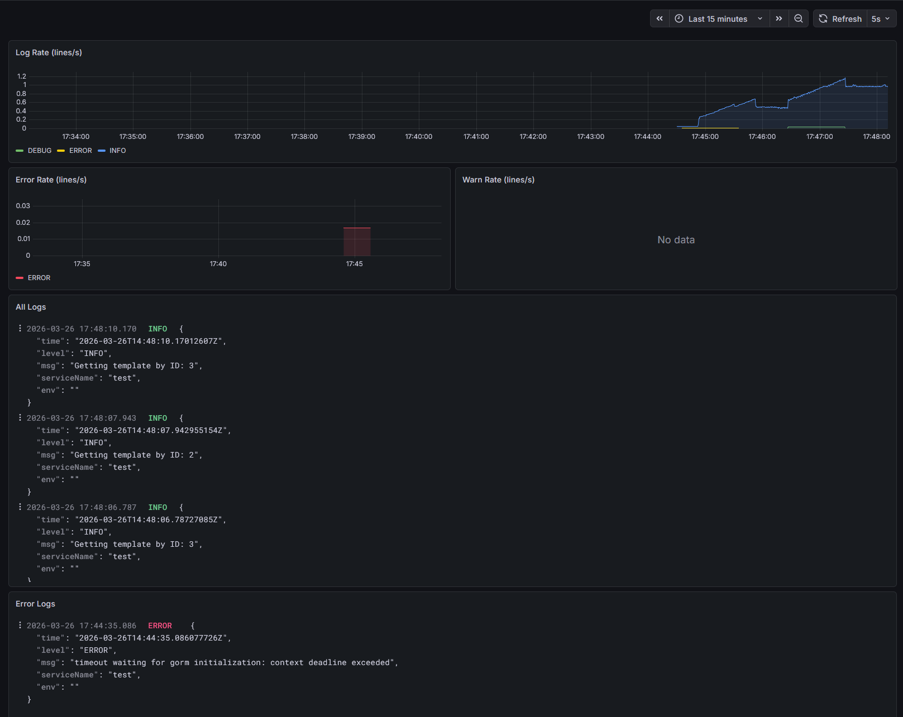

# Logging: Grafana Loki + LogQL

## Обзор архитектуры

```
go  init  manager (stdout JSON)
        │
        ▼  Docker socket
    Promtail  ──── парсит JSON, навешивает labels
        │
        ▼  push API
      Loki (:3100)  ────  хранит логи (TSDB + filesystem)
        │
        ▼  datasource
    Grafana (:3000)  ──► Dashboard "go  init  manager / Logs"
```

   go  init  manager    Пишет структурированные JSON  логи в stdout  
   Promtail      Агент — собирает логи из Docker, парсит, отправляет в Loki 9080
   Loki          Хранилище логов (индексирует labels, сжимает chunks)       3100
   Grafana       Визуализация через LogQL  запросы                          3000  

      

## Запуск

```bash
cd virtualization

docker compose   f docker  compose  all.yml   f docker  compose.override.yml     profile observe up   d
```

Grafana → http://localhost:3000 → Dashboards → **go  init  manager / Logs**


## Как работает сбор логов

### 1. go  init  manager пишет JSON в stdout

Сервис использует `zap`  логгер (через `go  init  common`) в JSON  формате:

```json
{"level":"INFO","ts":1748000000.123,"caller":"graphql/produce_event.go:34","msg":"Публикация события","template_id":"abc","topic":"go  init  processing"}
```

### 2. Promtail читает Docker  логи

Promtail подключается к Docker daemon через Unix  сокет `/var/run/docker.sock` и использует **Docker Service Discovery** — автоматически находит контейнер `go_init_manager` без жёсткого указания путей к файлам.

`pipeline_stages` в конфиге Promtail:
   **`json`** — извлекает поля `level`, `msg`, `ts`, `caller` из JSON  строки лога
   **`labels`** — превращает `level` и `service` в Loki  лейблы для фильтрации
   **`timestamp`** — использует время из лога (`ts`), а не время получения

### 3. Loki хранит логи

Loki не парсит содержимое лога при записи — хранит сырые строки + лейблы. Индекс строится только по лейблам, что делает его очень эффективным по памяти.


## LogQL — язык запросов

LogQL похож на PromQL, но для логов. Запрос состоит из двух частей:

```
{selector}    pipeline
```

> **Важно:** Docker Compose формирует имена контейнеров как `<project>  <service>  <номер>`,
> например `virtualization  go_init_manager  1`. Поэтому вместо точного совпадения
> используется `container=~".*go_init_manager.*"`.

### Селекторы (обязательная часть)

```logql
# Все логи контейнера (regex  матч по имени)
{container=~".*go_init_manager.*"}

# Только ошибки (level — stream  лейбл, добавленный Promtail)
{container=~".*go_init_manager.*", level="ERROR"}

# По потоку вывода
{container=~".*go_init_manager.*", stream="stderr"}
```

### Фильтрация содержимого

```logql
# Содержит строку (case  sensitive)
{container=~".*go_init_manager.*"}   = "kafka"

# Не содержит
{container=~".*go_init_manager.*"} != "DEBUG"

# Регулярка (все альтернативы в группе для (?i))
{container=~".*go_init_manager.*"}   ~ "(?i)(kafka  topic)"

# Исключить по регулярке
{container=~".*go_init_manager.*"} !~ "healthcheck"
```

### Парсинг JSON

```logql
# Распаковать JSON и фильтровать по полю
{container=~".*go_init_manager.*"}    json    level=`ERROR`

# Достать конкретное поле из JSON
{container=~".*go_init_manager.*"}    json    line_format "{{.msg}} [{{.caller}}]"
```

### Метрики из логов (Log Metric Queries)

```logql
# Частота всех логов (строк/сек)
rate({container=~".*go_init_manager.*"}[1m])

# Частота ошибок
rate({container=~".*go_init_manager.*", level="ERROR"}[1m])

# Количество Kafka  событий за последние 5 минут
count_over_time({container=~".*go_init_manager.*"}   = "Публикация события" [5m])

# Разбивка по уровням
sum(rate({container=~".*go_init_manager.*"}[1m])) by (level)
```

### Полезные запросы для go  init  manager

```logql
# Все ошибки с парсингом JSON
{container=~".*go_init_manager.*"}    json    level=`ERROR`

# Логи связанные с Kafka (продюсер + консюмер)
{container=~".*go_init_manager.*"}    json    msg =~ "(?i)(kafka  topic  produce  consume  archive)"

# Логи конкретного шаблона по ID
{container=~".*go_init_manager.*"}    json    line_format "{{.msg}}"   = "abc  123"

# Медленные операции (если в логе есть поле duration)
{container=~".*go_init_manager.*"}    json    duration > 1s

# Последние 50 строк в реальном времени (через CLI)
logcli query '{container=~".*go_init_manager.*"}'     tail     limit=50
```

      

## Дашборд Grafana

**Dashboards → go  init  manager / Logs**



   Панель             Тип           LogQL
   Log Rate           Time Series    `sum(rate({container=...}[1m])) by (level)`
   Error Rate         Time Series    `sum(rate({..., level="ERROR"}[1m]))`
   Warn Rate          Time Series    `sum(rate({..., level="WARN"}[1m]))`
   All Logs           Logs           `{container=~".*go_init_manager.*"} \   json`
   Error Logs         Logs           `{...} \   json \   level=\`ERROR\``
   Kafka Events       Logs           `{...} \   json \   msg =~ "(?i)(kafka\  topic\  archive)"`


## Структура файлов

```
virtualization/
└── observability/
    ├── loki/
    │   └── loki  config.yaml          ← конфиг Loki (хранение, схема)
    └── promtail/
        └── promtail  config.yaml      ← конфиг агента (Docker SD, парсинг JSON)

grafana/provisioning/
├── datasources/
│   └── loki.yaml                     ← автоподключение Loki в Grafana
└── dashboards/
    └── go  init  manager  logs.json     ← JSON дашборда с логами
```

## Просмотр логов без Grafana

```bash
# Прямо из контейнера
docker logs go_init_manager   f

# Через Loki API (curl)
curl   G "http://localhost:3100/loki/api/v1/query_range" \
      data  urlencode 'query={container="go_init_manager"}' \
      data  urlencode 'limit=20' \
      data  urlencode 'start=1h'

# Через Loki API — только ошибки
curl   G "http://localhost:3100/loki/api/v1/query_range" \
      data  urlencode 'query={container="go_init_manager",level="ERROR"}' \
      data  urlencode 'limit=50'
```
