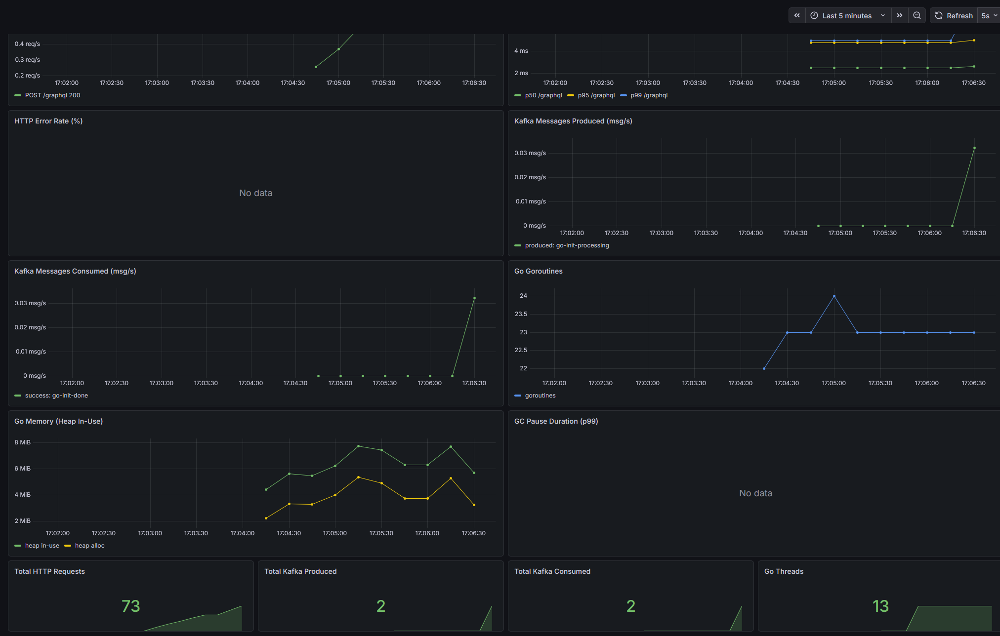

# Observability: Метрики go-init-manager

## Обзор архитектуры

```
go-init-manager (:60013/metrics)
        │
        ▼  scrape каждые 15 сек
   Prometheus (:9090)
        │
        ▼  datasource
     Grafana (:3000)  ─────► Dashboard "go-init-manager"
```

 Компонент       Роль                                        Порт  
-------------------------------------------------------------------
 go-init-manager Экспортирует метрики на `/metrics`          60013 
 Prometheus      Собирает и хранит метрики (TSDB)            9090  
 Grafana         Визуализирует метрики через дашборды        3000  
 cAdvisor        Метрики контейнеров Docker                  8080  
 node-exporter   Метрики хоста (CPU, RAM, диск, сеть)        9100  

---

## Запуск наблюдаемости

Стек поднимается через Docker Compose **профиль `observe`** поверх основного стека.

```bash
cd virtualization

# 1. Запустить основной стек + observability
docker compose -f docker-compose-all.yml -f docker-compose.override.yml \
  --profile observe up -d

# 2. Только observability (если основной уже запущен)
docker compose -f docker-compose-all.yml -f docker-compose.override.yml \
  --profile observe up -d prometheus grafana cadvisor nodeexporter
```

---

## Доступ к интерфейсам

 Сервис      URL                           Логин / Пароль      
---------------------------------------------------------------
 Grafana     http://localhost:3000         admin / admin        
 Prometheus  http://localhost:9090         —                   
 Метрики     http://localhost:60013/metrics  (raw Prometheus)  

---

## Дашборд Grafana

Дашборд **"go-init-manager"** загружается автоматически через provisioning.



Найти: **Dashboards → go-init-manager**

### Панели дашборда


 HTTP Request Rate               Time Series  Число запросов в секунду (по пути и статусу)  
 HTTP Request Duration           Time Series  Задержка p50 / p95 / p99 (в секундах)         
 HTTP Error Rate                 Time Series  Доля 5xx ответов в процентах                  
 Kafka Messages Produced         Time Series  Скорость отправки сообщений в Kafka           
 Kafka Messages Consumed         Time Series  Скорость получения сообщений из Kafka          
 Go Goroutines                   Time Series  Количество активных горутин                   
 Go Memory (Heap In-Use)         Time Series  Использование кучи (heap inuse / alloc)       
 GC Pause Duration (p99)         Time Series  Задержки сборки мусора p99                    
 Total HTTP Requests (stat)      Stat         Суммарное число HTTP-запросов с запуска       
 Total Kafka Produced (stat)     Stat         Суммарное число произведённых сообщений       
 Total Kafka Consumed (stat)     Stat         Суммарное число потреблённых сообщений        
 Go Threads (stat)               Stat         Количество OS-потоков                         

---


## Метрики сервиса

Все кастомные метрики имеют prefix `go_init_manager_`.

### HTTP

 Метрика                                         Тип        Labels                      
 `go_init_manager_http_requests_total`           Counter    `method`, `path`, `status`  
 `go_init_manager_http_request_duration_seconds` Histogram  `method`, `path`            

### Kafka

 Метрика                                          Тип      Labels             
 `go_init_manager_kafka_messages_produced_total`  Counter  `topic`            
 `go_init_manager_kafka_messages_consumed_total`  Counter  `topic`, `status`  

### Go runtime (стандартные, из `client_golang`)

 Метрика                             Описание                    
 `go_goroutines`                     Количество горутин          
 `go_threads`                        Количество OS-потоков       
 `go_memstats_heap_inuse_bytes`      Heap in-use                 
 `go_memstats_heap_alloc_bytes`      Heap allocated              
 `go_gc_duration_seconds`            Длительность GC-пауз        

---

## Полезные PromQL запросы

```promql
# Частота запросов к GraphQL
rate(go_init_manager_http_requests_total{path="/graphql"}[1m])

# p95 задержки GraphQL
histogram_quantile(0.95,
  rate(go_init_manager_http_request_duration_seconds_bucket{path="/graphql"}[5m])
)

# Ошибки 5xx за последние 5 минут
increase(go_init_manager_http_requests_total{status=~"5.."}[5m])

# Скорость продюсирования событий в Kafka
rate(go_init_manager_kafka_messages_produced_total[1m])

# Скорость потребления из топика go-init-done
rate(go_init_manager_kafka_messages_consumed_total{topic="go-init-done"}[1m])
```

---

## Структура файлов

```
virtualization/
├── observability/
│   ├── prometheus.yml                          ← конфиг Prometheus
│   └── grafana/
│       └── provisioning/
│           ├── datasources/
│           │   └── prometheus.yaml             ← автоподключение Prometheus в Grafana
│           └── dashboards/
│               ├── dashboards.yaml             ← конфиг провайдера дашбордов
│               └── go-init-manager.json        ← JSON дашборда
└── docker-compose.override.yml                 ← профиль observe

go-init-manager/
├── internal/
│   └── metrics/
│       └── metrics.go                          ← определение метрик + middleware
└── build/docker/
    └── Dockerfile                              ← обновлён для go mod tidy
```

---

## Остановка

```bash
cd virtualization
docker compose -f docker-compose-all.yml -f docker-compose.override.yml \
  --profile observe down
```
