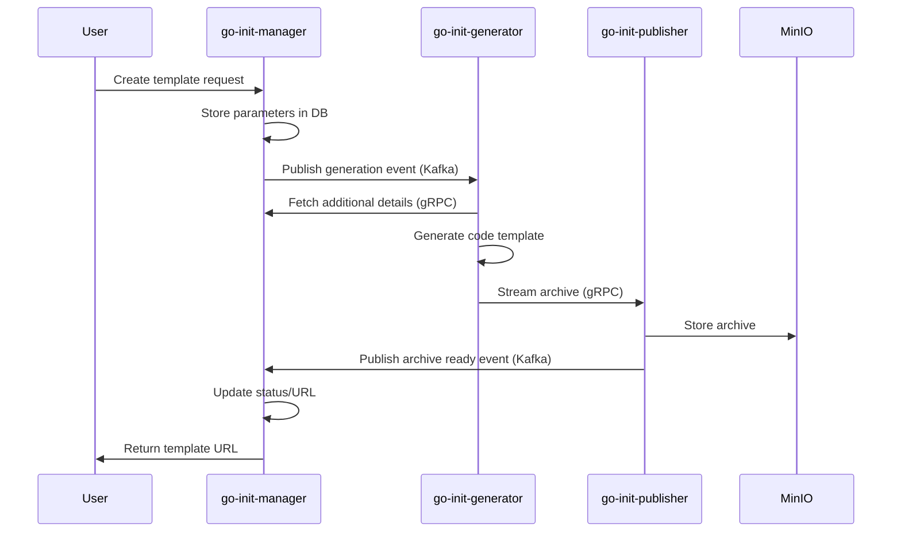

# Go Init Project


A microservices-based system for generating Go code templates with customizable features. This project enables rapid scaffolding of new Go services with pre-configured components and options.

## Architecture Overview

The system consists of three main microservices that communicate asynchronously through Kafka:

1. **go-init-manager** - Frontend API interface that receives user requests and manages template status
2. **go-init-generator** - Creates customized Go template archives based on user specifications
3. **go-init-publisher** - Stores and serves the generated template archives



## Features

- **Template Generation** - Create customized Go microservice templates
- **Multiple Communication Protocols** - Support for REST, GraphQL, and gRPC
- **Database Configuration** - Set up with different database backends
- **Docker Integration** - Containerization setup included
- **Advanced Options** - Authentication, documentation, and more

## Prerequisites

- Go 1.16+
- Docker and Docker Compose
- Git

## Local Development Setup

### 1. Clone the Repository

```bash
git clone https://github.com/yourusername/go-init-diplom.git
cd go-init-diplom
```

### 2. Start Required Infrastructure

Launch required services (PostgreSQL, Kafka, MinIO) using Docker Compose:

```bash
cd virtualization
docker-compose -f docker-compose-local.yml up -d
```

### 3. Configure Each Microservice

Create `.env` files in each microservice directory or use the default configuration:

**go-init-manager/.env**
```
HTTP_SERVER_PORT=8080
POSTGRES_HOST=localhost
POSTGRES_PORT=5432
POSTGRES_USER=go_init_usr
POSTGRES_PASSWORD=1234
POSTGRES_DB=go_init_manager_db
KAFKA_BROKERS=localhost:9092
```

**go-init-generator/.env**
```
HTTP_SERVER_PORT=8081
GRPC_SERVER_PORT=50051
KAFKA_BROKERS=localhost:9092
```

**go-init-publisher/.env**
```
HTTP_SERVER_PORT=8082
GRPC_SERVER_PORT=50052
POSTGRES_HOST=localhost
POSTGRES_PORT=5432
POSTGRES_USER=go_init_usr
POSTGRES_PASSWORD=1234
POSTGRES_DB=go_init_publisher_db
KAFKA_BROKERS=localhost:9092
MINIO_ENDPOINT=localhost:9000
MINIO_ACCESS_KEY=B6NZaLCC7AmyqSkdB2Rr
MINIO_SECRET_KEY=C8gZg0GSg31mEUs3BRVj7Dh5nIZ4HCvMPEHEamYq
MINIO_BUCKET=go-init-archives
```

### 4. Run Each Microservice

You'll need three terminal windows, one for each service:

**Terminal 1: Run manager**
```bash
cd go-init-manager
make run
```

**Terminal 2: Run generator**
```bash
cd go-init-generator
make run
```

**Terminal 3: Run publisher**
```bash
cd go-init-publisher
make run
```

### 5. Access the Services

- **Manager API**: http://localhost:8080/graphql - GraphQL API playground
- **Kafka UI**: http://localhost:8082 - Monitor Kafka events
- **MinIO Console**: http://localhost:9001 - Browse stored archives
- **PgAdmin**: http://localhost:6060 - Database management

## Deployment

For production deployment, use the full docker-compose configuration:

```bash
cd virtualization
docker-compose -f docker-compose-all.yml up -d
```

## Documentation

Each microservice has its own README with service-specific details:

- [Manager Documentation](go-init-manager/README.md)
- [Generator Documentation](go-init-generator/README.md)
- [Publisher Documentation](go-init-publisher/README.md)

## Contributing

1. Fork the repository
2. Create your feature branch (`git checkout -b feature/amazing-feature`)
3. Commit your changes (`git commit -m 'feat: add amazing feature'`)
4. Push to the branch (`git push origin feature/amazing-feature`)
5. Open a Pull Request

## License

This project is licensed under the MIT License - see the LICENSE file for details. 