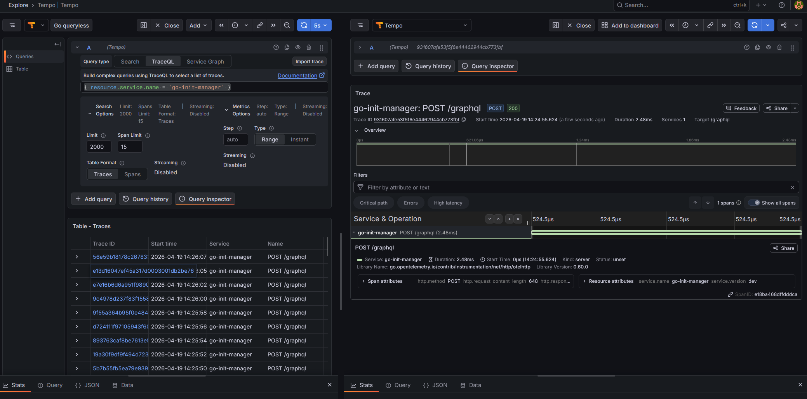
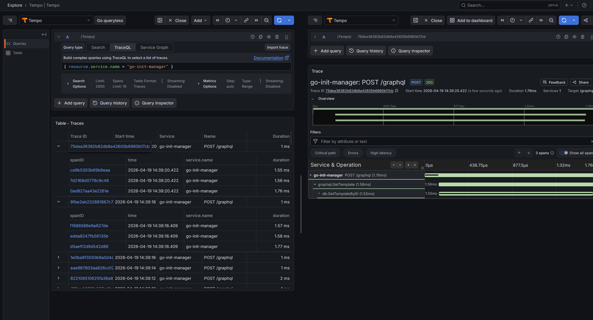

# Tracing: OpenTelemetry → Grafana Tempo → TraceQL

---

## Обзор архитектуры

```
go-init-manager (OpenTelemetry SDK)
        │  OTLP gRPC :4317  или  OTLP HTTP :4318
        ▼
     Tempo (:3200 API, :4317/:4318 приём)
        │
        ▼  datasource
    Grafana (:3000)  ───► Explore → Tempo (TraceQL)
```

| Компонент        | Роль                                              | Порт (хост) |
|------------------|---------------------------------------------------|-------------|
| go-init-manager  | Генерирует spans/traces (при включённом OTEL)     | —           |
| Tempo            | Принимает OTLP, хранит трейсы, отдаёт по API      | 3200, 4317, 4318 |
| Grafana          | Поиск трейсов, flame graph, связка с логами       | 3000        |

Подробности по TraceQL: [документация Grafana Tempo — TraceQL](https://grafana.com/docs/tempo/latest/traceql/).

---

## Запуск

Стек с трейсами входит в профиль observe .

```bash
cd virtualization

docker compose -f docker-compose-all.yml -f docker-compose.override.yml \
  --profile observe up -d

docker compose -f docker-compose-all.yml -f docker-compose.override.yml \
  --profile observe up -d prometheus grafana cadvisor nodeexporter loki promtail tempo
```

**Доступ**

| Сервис  | URL                         |
|---------|-----------------------------|
| Grafana | http://localhost:3000       |
| Tempo   | http://localhost:3200       |
| OTLP    | `localhost:4317` (gRPC), `localhost:4318` (HTTP) |

В Grafana источник данных **Tempo** подключается автоматически из provisioning (`uid`: `go-init-tempo`).

### go-init-manager (код)

В Grafana / Tempo видны только трейсы, которые ушли по OTLP. Нужно: `tracing.enabled: true` и непустой `otlp_endpoint` (например `http://go_init_tempo:4318` в Docker) **или** переменная `OTEL_EXPORTER_OTLP_ENDPOINT`, контейнер **Tempo** запущен (`--profile observe`), менеджер пересобран после изменений.

Отдельно: **TracerProvider всегда включён** — в **логах** (Loki) могут быть `trace_id` / `traceId` даже без экспорта; в **Tempo** без OTLP будет пусто.

Иерархия по **главным операциям из логов**:
- **Создание шаблона** (mutation `CreateTemplate`, лог «Публикация события…»): `POST /graphql` → **`graphql.CreateTemplate`** → **`db.CreateNewTemplate`** → **`kafka.Produce`**.
- **Чтение шаблона** (query `GetTemplate`, лог «Getting template by ID»): `POST /graphql` → **`graphql.GetTemplate`** → **`db.GetTemplateByUUID`** или **`db.GetTemplateByID`**.
- **Архив / Kafka done**: **`kafka.Consume`** → **`db.UpdateTemplateStatusByUUID`** / **`db.UpdateZipUrl`**.

В TraceQL сервис: **`go-init-manager`** (`resource.service.name`). Примеры по имени span:

```traceql
{ name = "graphql.CreateTemplate" }
```

```traceql
{ name = "graphql.GetTemplate" }
```

---

## Поиск трейсов в UI Grafana (кратко)

**Готовые запросы TraceQL** (скопировать в Explore → Tempo):

```traceql
{ resource.service.name = "go-init-manager" }
```

Узкое условие по HTTP (у нас span называется `POST /graphql`, не GET):

```traceql
{ resource.service.name = "go-init-manager" && name = "POST /graphql" }
```

Если список пустой: проверьте время, что **go_init_tempo** в `docker ps`, что в `manager-config.yml` стоит `tracing.enabled: true` и `otlp_endpoint: http://go_init_tempo:4318`, и что менеджер в той же Docker-сети, что и Tempo.

### Примеры из отчёта (скриншоты)

**Поиск трейсов** — Explore, datasource Tempo, запрос TraceQL и таблица результатов:



**Трейс и spans** — открытый трейс: дерево операций (waterfall), вложенные `POST /graphql` → `graphql.*` → `db.*` → `kafka.*`:



---

## 1. Генерация трейсов

**Трейс (trace)** — дерево операций одного запроса. Узел дерева — **span** (имя, время начала/конца, атрибуты, статус, ссылка на родителя).

**Практика в Go (OpenTelemetry)**

- Подключаются пакеты `go.opentelemetry.io/otel`, экспортер OTLP, `sdk/trace`.
- **Корневой server-span** на запрос: `otelhttp` на `POST /graphql`.
- **Дочерние spans** на доменную операцию и I/O: `internal/tracing` (`graphql.*`, `db.*`, `kafka.*`); контекст пробрасывается вниз, чтобы parent/child в Tempo совпадали с деревом вызовов.

---

## 2. Отправка (экспорт OTLP)

Tempo в этом репозитории слушает OTLP **внутри Docker-сети** на `go_init_tempo:4317` (gRPC) и `go_init_tempo:4318` (HTTP).


---

## 3. Просмотр (дополнительно)

На странице трейса: waterfall, атрибуты spans, ошибки. По **Trace ID** можно открыть трейс напрямую (вкладка **Trace ID** / поле ввода id), если скопировали `trace_id` из лога в Loki.

Связка **Traces → logs**: в настройках datasource Tempo (или provisioning) — [Configure trace to logs](https://grafana.com/docs/grafana/latest/datasources/tempo/configure-tempo-data-source/configure-trace-to-logs/).

---

## 4. TraceQL — язык запросов

TraceQL описывает **набор spans**, из которых собираются трейсы (аналогично тому, как LogQL фильтрует потоки логов, а PromQL — временные ряды).

### Базовый селектор

Запрос — это набор условий в фигурных скобках. Часто начинают с сервиса:

```traceql
{ resource.service.name = "go-init-manager" }
```

### Имя span и вид

```traceql
{ name = "POST /graphql" }

{ kind = server }
```

`kind`: `unspecified`, `internal`, `server`, `client`, `producer`, `consumer`.

### Длительность и статус

```traceql
{ duration > 500ms }

{ duration >= 1s && duration <= 5s }

{ status = error }

{ status = ok }
```

### Атрибуты (точка в имени — как в OpenTelemetry)

```traceql
{ span.http.response.status_code = 500 }

{ resource.service.version = "1.0.0" }
```

### Комбинации

```traceql
{ resource.service.name = "go-init-manager" && status = error }

{ resource.service.name = "go-init-manager" && duration > 2s }
```

### Сравнение с LogQL / PromQL (интуиция)

| Идея        | Метрики (PromQL) | Логи (LogQL)   | Трейсы (TraceQL)   |
|------------|------------------|----------------|--------------------|
| Что ищем   | Счётчики, гистограммы | Строки логов | Spans / traces     |
| Фильтр     | Селектор по метке `{job="..."}` | `{container="..."}` | `{ resource.service.name = "..." }` |
| Условия    | Функции `rate()`, `histogram_quantile` | Конвейер `\| json \| ...` | `&&`, сравнения, `status`, `duration` |

Полный синтаксис и продвинутые конструкции (структурные операторы, агрегаты): [TraceQL structural](https://grafana.com/docs/tempo/latest/traceql/structural/).

---


---

## Структура файлов

```
go-init-manager/
├── config/
│   └── tracing.go                     ← секция tracing в AppConfig
├── internal/
│   └── tracing/                       ← Init OTLP, otelhttp, хелперы span
│       ├── tracing.go
│       └── spans.go
└── build/config/config.yml            ← tracing.enabled / otlp_endpoint

virtualization/
├── configs/manager-config.yml         ← то же для Docker
├── docker-compose.override.yml        ← сервис tempo, volume
└── observability/
    ├── tempo/
    │   └── tempo.yaml                 ← конфиг Tempo (OTLP + local storage)
    └── grafana/provisioning/
        └── datasources/
            └── tempo.yaml             ← datasource Tempo в Grafana
```

---

## Остановка

```bash
cd virtualization
docker compose -f docker-compose-all.yml -f docker-compose.override.yml \
  --profile observe down
```

Данные Tempo лежат в volume `go_init_tempo_data`; при необходимости удалите volume отдельно, чтобы очистить трейсы.
